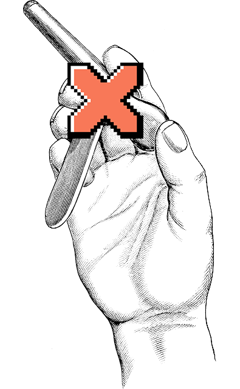

Nodebug
=======



Nodebug is a script for detecting leftover debug code in staged changes, like
`console.log` or `focus: true`. Which can be useful to avoid committing it into
repo. It can be used in [precommit hooks][precommit-hook] to make it most
effective.

For the time being it catches js and ruby related debug code.

Installation
------------

### Homebrew

```bash
brew tap welldan97/nodebug
brew install nodebug
```

### Manual

```bash
git clone https://github.com/welldan97/nodebug.git
```

And then make sure that `nodeubug` is in your `$PATH`.

Usage
-----

```bash
$ nodebug

There were some staged changes found with debug info
You can add files to .nodebugignore if you want yet to proceed with commit

spec/models/user_spec.rb
```

### Usage in Precommit hooks ###

Create a file in `.git/hooks/pre-commit` with the contents

```bash
#!/bin/sh
nodebug
```

Then run:

```bash
$ git commit

There were some staged changes found with debug info
You can add files to .nodebugignore if you want yet to proceed with commit

spec/models/user_spec.rb
```

### Ignoring files ###

You can ignore some files by adding globs to the file `.nodebugignore` in the
root of your project. I.e.:

```
app/assets/**/*.scss
app/views/users/new.html.erb
```

---

Originally extracted from [welldan97/dotfiles][welldan97-dotfiles]

[welldan97-dotfiles]: https://github.com/welldan97/dotfiles
[precommit-hook]: https://git-scm.com/docs/githooks#_pre_commit
